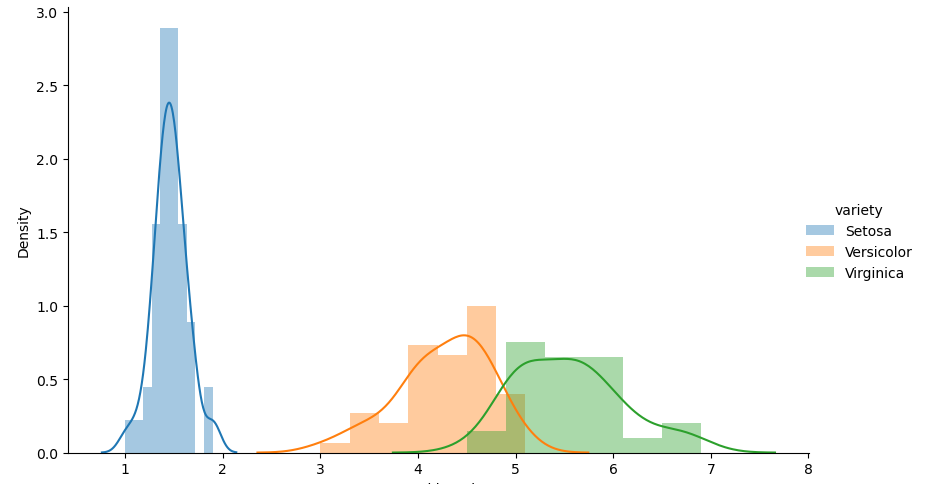
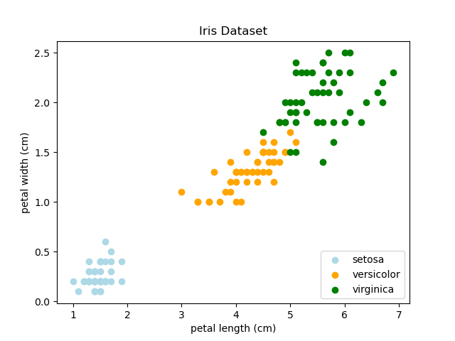

#+TITLE: AICE3001/AICE6002: Mathematics of Machine Learning
#+SUBTITLE: Subsidiary Notes --- Lecture 28: When Machine Learning Works
#+SETUPFILE: setup.org

* Keywords
  * When ML Works, Bias Variance

* Main Points

** Generalisation
   - We train our learning machines on a finite data set
   - But we use our learning machines on unseen data
   - If we have a too simple machine we might not be able to fit the
     training data and are unlikely to do well on unseen data
     #+ATTR_LATEX: :width 0.4\textwidth
     [[file:figures/curveFitting-1.pdf]]
   - If we have a too complicated machine we might be able to fit the
     training data almost perfectly, but we might have learnt a too
     complex rule that doesn't fit the test set
     #+ATTR_LATEX: :width 0.4\textwidth
     [[file:figures/curveFitting-3.pdf]]
   - Often there is a good compromise so that the learning machine
     learns a simple rule that fits the training data quite well but
     isn't too complicated
     #+ATTR_LATEX: :width 0.4\textwidth
     [[file:figures/curveFitting-2.pdf]]
   - We can think of the features and labels coming from an underlying
     distribution $\mu(\bm{x},y)$.  For example, in the famous iris
     dataset we have four features (petal/sepal length/width).  We
     imagine there is some probability density function for each
     feature.  The petal length might be distributed as shown
     #+ATTR_LATEX: :width 0.4\textwidth
     
   - The features are actually jointly distributed (in 4
     "dimensions").  E.g. the petal length and petal width are quite correlated
     #+ATTR_LATEX: :width 0.4\textwidth
     
   - An assumption we make (which has to be approximately correct for
     machine learning to have a chance of working) is that the
     testing data (where we are going to use the machine) is similar
     to the training data.  Mathematically we can model this by
     assuming they both come from the same underlying distribution,
     $\mu(\bm{x}, y)$

** Bias-Variance Dilemms
    - We assume that we are trying to learn some function $f(\bm{x})$
       where $\bm{x}$ are feature vectors
    - Our task is to learn a function $\hat{f}\left(\bm{x} |
      \mathcal{D}\right)$ based on a training set $\mathcal{D}$
    - We consider a scenario where we draw different training datasets
      $\mathcal{D}$ from a distribution of training examples $p(\bm{x})$
    - Each training set contains $m$ independent examples
    - We start from the definition of the /mean machine/
      $$  \hat{f}_m(\bm{x}) = \av[\mathcal{D}]{ \hat{f}\left(\bm{x} |
      \mathcal{D}\right)} $$
    - The mean machine makes a prediction by averaging the results of
      machines trained on all possible learning datasets (clearly
      this is a thought experiment and not something practical)
    - Now the *bias* is equal to generalisation performance of mean
      machine
      $$ B = \sum_{\bm{x}\in\mathcal{X}} p(\bm{x}) \left(
      \hat{f}_m(\bm{x}) - f(\bm{x}) \right)^2 $$
    - We consider the expected generalisation loss for a
      randomly drawn dataset
      + For any particular dataset we might do better or worse than
        this expected generalisation loss
	\begin{align*}
        \bar{L}_G &\eq \av[\mathcal{D}]{ L_G(\mathcal{D}) } 
            \eq \av[\mathcal{D}]{  \sum_{\bm{x}\in\mathcal{X}} p(\bm{x})\,
              \left(\hat{f}(\bm{x}\vert \mathcal{D}) -
              f(\bm{x}) \right)^2}
            \\
           &\eq  \sum_{\bm{x}\in\mathcal{X}} p(\bm{x})\,
           \av[\mathcal{D}]{ 
           \left(\hat{f}(\bm{x}\vert \mathcal{D}) - f(\bm{x}) \right)^2}
           \\
          &\eq \sum_{\bm{x}\in\mathcal{X}} p(\bm{x})\, \av[\mathcal{D}]{
          \left(\left(\hat{f}(\bm{x}\vert
          \mathcal{D})
          -\hat{f}_m(\bm{x}) \right) + \left(
          \hat{f}_m(\bm{x}) - f(\bm{x})\right) \right)^2
          } \\
            &\eq  \sum_{\bm{x}\in\mathcal{X}} p(\bm{x}) \Biggl(
              \av[\mathcal{D}]{ 
              \left(\hat{f}(\bm{x}\vert \mathcal{D}) -
              \hat{f}_m(\bm{x}) \right)^2 + \left(
              \hat{f}_m(\bm{x}) - f(\bm{x}) \right)^2 }  \\
            & \hspace{5cm} + 2 \, \av[\mathcal{D}]{
              \left(\hat{f}(\bm{x}\vert \mathcal{D}) -
              \hat{f}_m(\bm{x}) \right)\left(
              \hat{f}_m(\bm{x}) - f(\bm{x}) \right) } \Biggr)
            \end{align*}
	    \explanation
	1) This is the definition of the expected generalisation loss, $\bar{L}_G$
	2) The generalisation loss is the squared difference between
           the prediction of the learning machine,
           $\hat{f}(\bm{x}\vert \mathcal{D})$, and the true function,
           $f(\bm{x})$, averaged over all possible input feature vectors,
           $\bm{x}$, weighted by the probability of the input, $p(\bm{x})$
	3) We exchange the sum and expectation
	4) We add and subtract the prediction of the mean machine
	5) We expand out the sum
      + The cross term cancels
          \begin{align*}
          C &= \av[\mathcal{D}]{ \left(\hat{f}(\bm{x}\vert \mathcal{D}) -
   		   \hat{f}_m(\bm{x}) \right)\left(
   		   \hat{f}_m(\bm{x}) - f(\bm{x}) \right) }\\
   	  &= \left(\av[\mathcal{D}]{\hat{f}(\bm{x}\vert \mathcal{D})} -
   		   \hat{f}_m(\bm{x}) \right)\left(
   		   \hat{f}_m(\bm{x}) - f(\bm{x}) \right)\\
   	  &= \left(\hat{f}_m(\bm{x}) -
   		   \hat{f}_m(\bm{x}) \right)\left(
   		   \hat{f}_m(\bm{x}) - f(\bm{x}) \right) = 0
          \end{align*}
      + Note we use the following properties of expectations
	1. $\av{A + B} = \av{A} + \av{B}$
	2. $\av{c\,A} = c\,\av{A}$ where $c$ doesn't depend on the
           random variable you are averaging over
	3. $\av{1} = 1$
      + We are left with
	  \begin{align*}
              \bar{L}_G &= \sum_{\bm{x}\in\mathcal{X}} p(\bm{x})
              \av[\mathcal{D}]{ 
              \left(\hat{f}(\bm{x}\vert \mathcal{D}) -
              \hat{f}_m(\bm{x}) \right)^2 + \left(
              \hat{f}_m(\bm{x}) - f(\bm{x}) \right)^2 } \\
	       &= \sum_{\bm{x}\in\mathcal{X}} p(\bm{x})\, 
               \av[\mathcal{D}]{ \left(\hat{f}(\bm{x}\vert \mathcal{D}) -
              \hat{f}_m(\bm{x})\right)^2 } +
             \sum_{\bm{x}\in\mathcal{X}} p(\bm{x}) \left( \hat{f}_m(\bm{x})
	- f(\bm{x}) \right)^2 
        \end{align*}
      + Where we used the fact that the last term doesn't depend on
        the dataset
      + The last term is equal to the bias, defined earlier as the
        generalisation performance of the mean machine
      + The first term is known as the *variance*
        \begin{align*}
          V = \sum_{\bm{x}\in\mathcal{X}} p(\bm{x})\,
          \av[\mathcal{D}]{ \left(\hat{f}(\bm{x}\vert \mathcal{D}) -
          \hat{f}_m(\bm{x})\right)^2 } 
        \end{align*}
      + It measure how a single learning machine differs from the mean machine
      + We therefore have $\bar{L}_G = B + V$ or
	$$ \text{Expected Generalisation Loss} = \text{Bias} +
        \text{Variance} $$
    - The *Bias-Variance Dilemma* is that
      + Simple machine are likely to have high bias
	* because any single machine can't represent the data well the
          mean machine won't be accurate
	* this is true of the curve fitting example, but it is not
          true of decision trees where the average of many decision
          trees can learn a far more complex division boundary than a
          single machine
      + Complex machines are likely to have high variance
	* Complex machine are likely to be sensitive to the training
          data whereas simpler machines (because of their lack of
          flexibility) aren't as sensitive
    - A lot of this course will be looking at machines that cleverly
      resolve this dilemma

* Experiments
  Download the Jupyter Notebook

  - This computes the training and generalisation loss as well as
    the bias and variance for arbitrary functions (at least approximately)
  - We can do this because it is a 1-D function
  - See if you can understand the code

** Questions
   - What is the effect of increasing the number of training points?
   - What is the effect of using a more complex function, E.g. $\e{-x} \sin(x)$?

* COMMENT [[file:information.org][Previous]]  [[file:overfitting.org][Next]]
