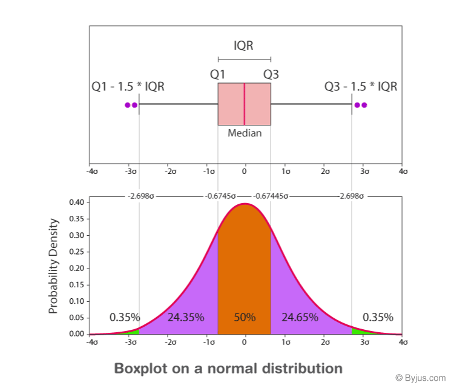

#+TITLE: AICE3001/AICE6002: Mathematics of Machine Learning
#+SUBTITLE: Subsidiary Notes --- Lecture 20: On Becoming a Scientist
#+SETUPFILE: setup.org

* Keywords
  * Reproducibility, standard error, error bars, Bernoulli trials, null hypothesis, t-tests, statistical significance

* Main Points

** Reproducibility and Reporting
   * Science requires that experiments can be reproduced, and machine
     learning is no exception
   * A report should tell a story: why the work is interesting, and
     what specifically is being tested
   * It must also give enough detail for someone else to reproduce the
     work.  For a deep learning experiment that means
     - the architecture
     - the dataset, and how it was split into training, validation and
       test sets
     - any preprocessing
     - the optimiser, mini-batch size and learning rate
     - the number of epochs
     - any hyper-parameter tuning
     - how long training took, on what hardware
   * Publishing code is good practice but does not replace describing
     the method in the report
   * Presenting results is not enough; you must interpret them.  Every
     result is uncertain---a different test set would give a different
     number---so /results are meaningless unless their uncertainty is
     quantified/

** Experimental Error
   * If algorithm A scores 95% and algorithm B scores 97%, could the
     difference have happened by chance?
   * To answer this we assume the test examples are typical and
     independent (not, for example, the same example repeated).  These
     assumptions are not always true and should be checked

** Estimating the Mean and its Error
   * From measurements $X_1,\ldots,X_n$ we estimate the mean and variance by
     \begin{align*}
       \hat{\mu}_n &= \frac{1}{n}\sum_{i=1}^n X_i
       & \hat{\sigma}_n^2 &= \frac{1}{n-1}\sum_{i=1}^n \bra{X_i - \hat{\mu}_n}^2
     \end{align*}
     These are /unbiased/: $\av{\hat{\mu}_n} = \mu$ and
     $\av{\hat{\sigma}_n^2} = \sigma^2$
   * The mean squared error of $\hat{\mu}_n$ is
     \begin{align*}
       \av{(\hat{\mu}_n-\mu)^2}
         &= \frac{1}{n^2}\av{\bra{\sum_{i=1}^n (X_i-\mu)}\bra{\sum_{j=1}^n (X_j-\mu)}} \\
         &= \frac{1}{n^2}\sum_{i=1}^n \bra{\av{(X_i-\mu)^2} + \sum_{j\neq i}\av{X_i-\mu}\,\av{X_j-\mu}}
          = \frac{\sigma^2}{n}
     \end{align*}
     because independence lets the cross terms factorise, and each factor
     $\av{X_i-\mu}$ is zero
   * The root mean squared error is $\sigma/\sqrt{n}$.  The /standard
     error/ (or estimated error in the mean) replaces $\sigma$ by its
     estimate:
     $$ \Delta = \frac{\hat{\sigma}_n}{\sqrt{n}} $$
   * Report a result as $\hat{\mu}_n \pm \Delta$, quoting only the
     significant figures that $\Delta$ justifies: not
     $1.6582356 \pm 0.122543$ but $1.7 \pm 0.1$

** Repeated Bernoulli Trials
   * A success/failure outcome (e.g. a test example classified
     correctly or not) with independent trials is a /Bernoulli trial/
     with unknown success probability $p$
   * The number of successes $K$ in $n$ trials is binomial,
     $$ \Prob{K=k} = \binom{n}{k} p^k (1-p)^{n-k} $$
     with $\av{K} = n\,p$ and $\av{(K-n\,p)^2} = n\,p\,(1-p)$
   * The estimate $\hat{p} = K/n$ has mean squared error
     $$ \av{(\hat{p}-p)^2} = \frac{1}{n^2}\av{(K-n\,p)^2} = \frac{p\,(1-p)}{n} $$
   * We don't know $p$, so the standard error is estimated as
     $$ \Delta \approx \sqrt{\frac{\hat{p}\,(1-\hat{p})}{n}} $$
   * $p(1-p)$ is largest at $p=1/2$, which gives the worst case bound
     $\Delta \leq 1/(2\sqrt{n})$.  This is pessimistic when $p$ is small,
     while the estimate above is over-optimistic when $\hat{p}=0$
   * A quick rule of thumb: $n=10\,000$ test examples give a standard
     error of at most $0.5\%$

** Error Bars
   * Conventions differ, so always say what your error bars show
     - *one standard error* $(\pm\Delta)$: the traditional choice.  For
       roughly normal data the true mean lies outside the bar about 32%
       of the time
     - *95% confidence interval*: about $\pm 2\Delta$ (more precisely
       $\pm 1.96\,\Delta$ for large $n$)
     - *standard deviation*: describes the spread of the data, not the
       confidence in the mean, so it should not be used as an error bar
       on a mean
   * Box plots summarise a distribution rather than the uncertainty in
     its mean
     #+ATTR_LATEX: :width 0.6\linewidth
     

** Comparing Models
   * How do we decide whether model B really is better than model A?
     The lecture animation repeatedly simulates two models whose true
     performances differ, and shows that with few test examples the
     worse model often appears better; with more data such mistakes
     become rare
     #+ATTR_LATEX: :width 0.8\linewidth
     [[file:figures/simulation-25.pdf]]
   * To quantify this we use a /null hypothesis/: /models A and B have
     the same performance/.  We then ask how likely a gap at least as
     large as the one observed would be if the null hypothesis were
     true.  This probability is the /p-value/
   * The answer depends on the size of the gap, the number of
     observations and the variance

** T-tests
   * William Gosset invented the t-test while working for the Guinness
     brewery, publishing under the pseudonym /Student/.  Student's test
     assumes both sets of results are normal with the same mean and the
     same variance under the null hypothesis
   * /Welch's t-test/, more common now, allows the variances to differ.
     With $n$ results for A and $m$ for B,
     \begin{align*}
       t &= \frac{\hat{\mu}_A - \hat{\mu}_B}{\hat{\sigma}_{A,B}}
       & \hat{\sigma}_{A,B} &= \sqrt{\frac{\hat{\sigma}_A^2}{n} + \frac{\hat{\sigma}_B^2}{m}}
     \end{align*}
   * The p-value follows from $t$ and the effective number of
     degrees of freedom (the Welch--Satterthwaite formula)
     $$ \nu = \frac{\hat{\sigma}_{A,B}^4}{\bra{\hat{\sigma}_A^2/n}^2/(n-1) + \bra{\hat{\sigma}_B^2/m}^2/(m-1)} $$
     Note the /fourth/ power in the numerator: $\nu$ is dimensionless
   * A small p-value means the observed gap would be unlikely if the
     null hypothesis were true.  By convention A is called
     /statistically significantly/ different from B when $p < 0.05$
   * Statistical significance does not mean the difference matters;
     that is a separate judgement
   * The test assumes normally distributed results.  Few people check,
     and it is usually a reasonable approximation, but there are
     exceptions
   * Example with $X\sim\mathcal{N}(0.4,1)$ and
     $Y\sim\mathcal{N}(0.6,0.25)$:
     #+ATTR_LATEX: :width 0.7\linewidth
     [[file:figures/tTest.pdf]]
     #+ATTR_LATEX: :width 0.7\linewidth
     [[file:figures/tTesteb.pdf]]

** Error Bars and Significance
   * It is tempting to judge significance by whether error bars overlap,
     but this needs care
     #+ATTR_LATEX: :width 0.8\linewidth
     [[file:figures/errorbarsT.pdf]]
   * For two independent means with equal standard errors $\Delta$ the
     standard error of the difference is $\sqrt{2}\,\Delta$.  If
     one-standard-error bars just touch, the gap is $2\Delta$ and
     $t = 2\Delta/(\sqrt{2}\,\Delta) = \sqrt{2} \approx 1.41$, giving
     $p \approx 0.16$ for large samples---/not/ significant at the 5%
     level
   * For significance at 5% the gap must be about
     $1.96\times\sqrt{2}\,\Delta \approx 2.8\,\Delta$, i.e. the bars must
     be separated by a further $0.8\,\Delta$ or so
   * Conversely, non-overlapping 95% confidence intervals imply a
     difference well beyond the 5% level.  When in doubt, do the test

** Paired T-tests
   * Sometimes much of the variation comes from the test examples
     themselves: model A may be consistently better than B, but both do
     well on easy examples and badly on hard ones
   * An ordinary t-test can then miss a real difference
   * A /paired/ t-test works with the per-example differences
     $D_i = X_i - Y_i$, whose variance is
     \begin{align*}
       \hat{\sigma}_D^2 &= \hat{\sigma}_X^2 + \hat{\sigma}_Y^2 - 2\,\hat{c}_{X,Y}
       & \hat{c}_{X,Y} &= \frac{1}{n-1}\sum_{i=1}^n (X_i-\hat{\mu}_X)(Y_i-\hat{\mu}_Y)
     \end{align*}
     and then $t = \hat{\mu}_D/(\hat{\sigma}_D/\sqrt{n})$ with $n-1$
     degrees of freedom.  A strong positive correlation $\hat{c}_{X,Y}$
     removes the shared variation
   * Example with $X = Z + X_1$, $Y = Z + Y_1$, a shared
     $Z\sim\mathcal{N}(0,0.8)$, $X_1\sim\mathcal{N}(0.4,0.2)$ and
     $Y_1\sim\mathcal{N}(0.6,0.2)$:
     #+ATTR_LATEX: :width 0.7\linewidth
     [[file:figures/pairedTtest.pdf]]
     #+ATTR_LATEX: :width 0.7\linewidth
     [[file:figures/pairedTtesteb.pdf]]

** Pitfalls
   * *Run the test once.*  At $p<0.05$ a true null hypothesis produces a
     "significant" result one time in twenty.  Run the test twice and
     the chance of at least one false positive is
     $1-0.95^2 \approx 0.1$; running tests until one succeeds is cheating
   * To compare many models use a method designed for it, such as
     ANOVA, or correct the threshold for the number of tests
   * *Simulating the null hypothesis.*  The t-test distribution comes
     from a difficult calculation, but you can also simulate the null
     hypothesis many times and count how often the simulated statistic
     exceeds the observed one.  This works whenever the null hypothesis
     is easy to simulate, even when normality fails
   * *Heavy tails.*  For distributions with thick tails, such as the
     Cauchy distribution, averaging many samples need not give a
     reliable estimate of the mean.  When nothing makes sense, plot a
     histogram
     #+ATTR_LATEX: :width 0.55\linewidth
     [[file:figures/cauchy.pdf]]
   * /The person you cheat when you don't do this is yourself/

* Exercises

** Reporting a classification accuracy
   * A classifier gets 912 of 1000 test examples right.  Estimate its
     accuracy and standard error, and write the result down sensibly

** How big a test set?
   * How many test examples do you need to guarantee a standard error of
     at most 0.5% in an accuracy, whatever the true accuracy?

** Unbiased variance
   * Show that $\av{\hat{\sigma}_n^2} = \sigma^2$ when
     $\hat{\sigma}_n^2 = \frac{1}{n-1}\sum_i (X_i-\hat{\mu}_n)^2$ and the
     $X_i$ are independent

** Touching error bars
   * Two models are each evaluated on many independent test examples
     and have equal standard errors $\Delta$.  Their one-standard-error
     bars just touch.  Is the difference significant at the 5% level?

** Multiple comparisons
   * You compare 10 models against a baseline using separate t-tests at
     the 5% level.  None of them is actually any different from the
     baseline.  What is the probability that at least one test reports
     a significant difference?

* Answers

** Reporting a classification accuracy
   * $\hat{p} = 0.912$ and
     $\Delta = \sqrt{0.912\times0.088/1000} \approx 0.0090$
   * So the accuracy is $0.912 \pm 0.009$, or $(91.2 \pm 0.9)\%$

** How big a test set?
   * The worst case is $\Delta \leq 1/(2\sqrt{n})$.  Requiring
     $1/(2\sqrt{n}) \leq 0.005$ gives $\sqrt{n} \geq 100$, so
     $n \geq 10\,000$

** Unbiased variance
   * Write $X_i - \hat{\mu}_n = (X_i - \mu) - (\hat{\mu}_n - \mu)$.  Then
     \begin{align*}
       \sum_i (X_i-\hat{\mu}_n)^2
         &= \sum_i (X_i-\mu)^2 - 2\,(\hat{\mu}_n-\mu)\sum_i (X_i-\mu) + n\,(\hat{\mu}_n-\mu)^2 \\
         &= \sum_i (X_i-\mu)^2 - n\,(\hat{\mu}_n-\mu)^2
     \end{align*}
     since $\sum_i (X_i - \mu) = n\,(\hat{\mu}_n - \mu)$
   * Taking expectations, and using $\av{(\hat{\mu}_n-\mu)^2} = \sigma^2/n$,
     $$ \av{\sum_i (X_i-\hat{\mu}_n)^2} = n\,\sigma^2 - \sigma^2 = (n-1)\,\sigma^2 $$
     so dividing by $n-1$ gives an unbiased estimate

** Touching error bars
   * The gap is $2\Delta$ and the standard error of the difference is
     $\sqrt{\Delta^2+\Delta^2} = \sqrt{2}\,\Delta$, so
     $t = \sqrt{2} \approx 1.41$
   * With many examples $t$ is approximately normal, and
     $\Prob{|Z| > 1.41} \approx 0.16$.  The difference is /not/
     significant at the 5% level

** Multiple comparisons
   * Each test independently gives a false positive with probability
     0.05, so the probability of none is $0.95^{10}$ and of at least one
     is $1 - 0.95^{10} \approx 0.40$

* COMMENT [[file:probability.org][Previous]]  [[file:bayes.org][Next]]
